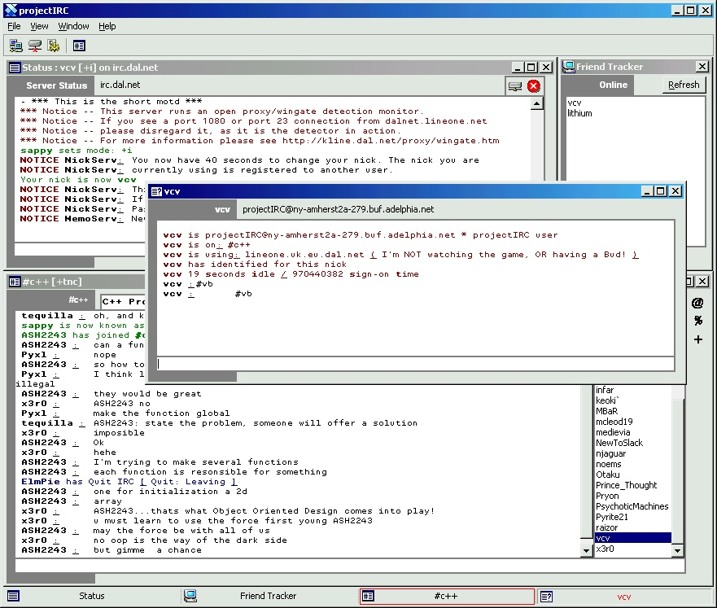



## projectIRC 1\.0 build 40\!

### Description

This is another update to my IRC Client.

I completely rewrote the color parsing sub to work better.

I fixed quite a few bugs, and added some nice features.

Straight from projectIRC.com:

First of all, I changed a few things with "hyperlinks". You now have to double click them, not right click. Also I fixed the bug with it switching between windows if you clicked a nick hyperlink.

I added #channel hyperlinks, so you can double click any words with # as the first letter and join that channel. And i added irc.* hyperlinks, if you click a server name that starts with irc., it will ask you if you want to connect to that IRC server. Thanks Joe :)

Fixed another bug that I won't even explain, but you may or may not notice it, nothing to worry about.

I added a text-history, for channels and quries at least. Just hit up to see what you last said, up again to see before that. Hit down to go back down.

Also I added it so it saves any server you type in the combo list and hit enter with, it will save it for next load. I'll add auto-complete for that soon.

Fixed the bug where query windows in the taskbar would have no text.

Also added a feature to the taskbar where if you click the active taskbar button, it will cause that window to hide, just like in mIRC :) (If Khaled doesn't like me stealing all his ideas, I'm sorry :( )

To continue with that list, I added whois, listing of channels (still not done), customization of colors, Icons to the taskbar, option of stretching the taskbar or having it a fixed width, you can join channels even if you leave out the # (ex: /join vb), that's all I can think of :)

One last thing, if anyone knows how to translate a # that is the # of seconds past Jan 1st 1970 into an actual readable date, using VB, please mail me~!. EX: 970411847 -> Sun Oct 01 10:50:47 2000 .. VB ONLY!
 
### More Info
 

             |
---                |---
**Submitted On**   |2000-10-01 18:37:02
**By**             |[vcv](https://github.com/Planet-Source-Code/PSCIndex/blob/master/ByAuthor/vcv.md)
**Level**          |Advanced
**User Rating**    |5.0 (25 globes from 5 users)
**Compatibility**  |VB 6\.0
**Category**       |[Complete Applications](https://github.com/Planet-Source-Code/PSCIndex/blob/master/ByCategory/complete-applications__1-27.md)
**World**          |[Visual Basic](https://github.com/Planet-Source-Code/PSCIndex/blob/master/ByWorld/visual-basic.md)
**Archive File**   |[CODE\_UPLOAD103421012000\.zip](https://github.com/Planet-Source-Code/vcv-projectirc-1-0-build-40__1-11821/archive/master.zip)

